<p align="center">
  <a href="https://discord.gg/eXUBTY6HAu">
      
  </a>
  <a href="https://github.com/Universidade-Livre/Learn4Elixir/fork">
      
  </a>
</p>

<p align="justify">
  <i>
  Há muito tempo, o lendário alquimista José Valim supostamente descobriu o segredo para criar 
o elixir da vida eterna, a fim de transmutar os elementos e alcançar a imortalidade. Embora a
busca pela imortalidade seja apenas uma fantasia, Valim deixou sua marca na história ao criar 
uma linguagem de programação chamada Elixir. Este repositório busca te apresentar a 
  "fórmula secreta" para aprender essa poderosa linguagem de programação. 
  </i>⚗️
</p>

<hr>

<p align="justify">
Durante o mês de Outubro, ocorre anualmente a <a href="https://hacktoberfest.com" target="_blank">Hacktoberfest</a>, um evento no qual os participantes 
são incentivados a contribuir com projetos e comunidades aos quais já pertencem. No entanto, é 
notório que poucos se aventuram em experiências inéditas durante o evento, deixando de explorar 
novas possibilidades que poderiam ser fascinantes.
</p>

Este é o mês da Hacktoberfest! E vamos participar esse ano criando esse evento.

<p align="justify">
Contribuir com a comunidade de programação durante a Hacktoberfest da Digital Ocean 
pode ser um desafio para muitos desenvolvedores. É comum que os participantes optem 
por contribuir em projetos nos quais já estão envolvidos, limitando assim o seu 
potencial de aprendizado e crescimento. O evento é uma oportunidade única para explorar 
novas áreas da programação e, neste ano, convidamos você a experimentar algo novo: a 
linguagem de programação Elixir. Desafie-se a aprender e contribuir para projetos em Elixir, 
expandindo assim suas habilidades e conhecimentos.
</p>

<p align="justify">
E melhor que isso, ganhando os brindes da Hacktoberfest enquanto aprende algo novo e fascinante 
com o apoio da Comunidade pelo <a href="https://discord.gg/eXUBTY6HAu">Discord</a>.
</p>

Vão ser:
- 4 Pull Requests para você receber um kit cortesia do evento ou plantar uma árvore.
- 4 Pull Requests para você aprender a programar em Elixir.
- 4 Pull Requests para fazer parte de comunidades de desenvolvedores.
- 4 Pull Requests para explodir a sua mente com conhecimento de algo novo.

## O que é o Learn4Elixir?
<p align="justify">
Learn4Elixir é um material de aprendizado hospedado no GitHub com o objetivo de ensinar as pessoas
a dar os primeiros passos em Elixir e em Programação Funcional enquanto fazem 4 Pull Requests.
</p>

<p align="justify">
Esse repositório está organizado com conteúdo e exercicios de código. Todos os conteúdos estão 
disponíveis em <i>livebooks</i> (um <i>livebook</i> é um arquivo contendo texto e código executável em uma instalação de http://livebook.dev), e você pode acompanhar acessando os links:
</p>

- [Capítulo 1](./chapters/chapter1.livemd)
- [Capítulo 2](./chapters/chapter2.livemd)
- [Capítulo 3](./chapters/chapter3.livemd)
- [Capítulo 4](./chapters/chapter4.livemd)

<p align="justify">
Para concluir este tutorial, é necessário que você realize um <i>fork</i> deste repositório. Dentro do mesmo, 
encontram-se quatro <i>livebooks</i> que contêm o conteúdo educacional, incluindo textos, links para vídeos, exemplos de código 
e exercícios. Mesmo que você não possua conhecimento prévio em programação funcional, é recomendado que tenha 
familiaridade com alguma linguagem de programação antes de começar. Os exercícios podem ser resolvidos em seu 
próprio tempo e a seu critério, e, em seguida, deve-se abrir um Pull Request (PR) para o seu fork deste projeto.
</p>

<p align="justify">
Caso necessite de feedback sobre sua solução, não hesite em nos chamar pelo canal #hacktoberfest do <a href="https://discord.gg/eXUBTY6HAu">Discord</a>
da Universidade Brasileira Livre. Estaremos sempre disponíveis para ajudá-lo a compreender algum conceito de Elixir 
que não tenha ficado claro, para corrigir sua solução ou, simplesmente, para incentivá-lo a continuar resolvendo 
os exercícios.
</p>

<p align="justify">
Cada parte deste tutorial contém informações únicas e abrange diferentes tópicos sobre a linguagem Elixir. Embora 
seja recomendável que você siga a ordem dos capítulos, não estamos aqui para julgar sua forma de estudar e aprender. 
Caso sinta-se confortável em pular algum capítulo por já ter familiaridade com alguma parte do conteúdo ou se julgar 
que é melhor fazer os capítulos em uma ordem diferente da padrão, tudo bem.
</p>

<p align="justify">
As partes deste tutorial estão organizadas para que não seja necessário ajuda externa além dos links e ferramentas 
que estão contidos no conteúdo de cada parte. Normalmente, espera-se que você gaste algumas horas por capítulo, mas 
é um investimento de tempo que podemos garantir que valerá a pena.
</p>

<p align="justify">
Após concluir todos os exercícios, você será capaz de ler, modificar e criar código em Elixir de forma independente, 
entender como fazer código usando o paradigma funcional e aplicar esses conceitos na linguagem que você trabalha.
</p>

### Programa do Curso

Aqui tem um plano mais detalhado do conteúdo que preparamos no tutorial para
você. Esses são os tópicos de cada parte:


- __Parte Um__ – Valores, Tipos de Valores, Casamento de Padrões, Variáveis, Atribuição de Valores, Coleções (listas e tuplas).
- __Parte Dois__ – Funções e Módulos, Funções Anônimas, Funções de Alta Ordem, Enum, Pipe, Funções Privadas.
- __Parte Três__ – Estruturas de Controle, Sigils, Compreensões.
- __Parte Quatro__ – Data e Tempo, Processos, Agentes.

## Objetivos

Os principais objetivos do projeto Learn4Elixir são:
- Criar um tutorial completo e organizado para aprender a programar em Elixir, sem a necessidade de conhecimentos prévios em programação funcional para pessoas que venham de outras linguagens de programação;
- Criar um conteúdo educacional que explique os principais tópicos da Linguagem Elixir de forma acessível;
- Gerar o feedback e suporte via [Discord](https://discord.gg/eXUBTY6HAu) durante o mês de Outubro de 2023 para que seja possível agregar valor e ajudar a impulsionar os participantes que desejam aprender Elixir;
- Contribuir com o crescimento e incentivar novos desenvolvedores a aprender sobre o paradigma funcional, em especial sobre uma linguagem de programação criada no Brasil que vem ganhando muito destaque e crescendo no mercado nacional e internacional.

## Vamos lá?

Começar a aprender com o Learn4Elixir é muito mamão com açúcar, é só:

1. [Fazer um fork desse repositório](https://github.com/Universidade-Livre/Learn4Elixir/fork)
2. Adicione `hacktoberfest` nos "topics" (tópicos) do seu fork. Caso contrário os PRs não vão contar.
3. [Instale a linguagem Elixir e/ou o Livebook](https://github.com/Universidade-Livre/Learn4Elixir/tree/main#instalando-elixir-e-o-livebook)
4. Abra o `src/Chapter1.livemd` e começe a resolver os desafios.
5. Após terminar as soluções do capítulo (ou até mesmo se tiver dificuldade e precisar de ajuda) você pode abrir um PR **para o seu fork** com a solução e mencionar @[anabastos](https://github.com/anabastos), @[cherry](https://github.com/cherryramatisdev), @[cyytrus](https://github.com/cyytrus), @[digzom](https://github.com/digzom), @[douglastofoli](https://github.com/douglastofoli), @[eulixir](https://github.com/eulixir), @[lanjoni](https://github.com/lanjoni), @[OtavioSC](https://github.com/otaviosc) ou @[zoedsoupe](https://github.com/zoedsoupe) que vamos ajudá-lo com a revisão de suas soluções.

> **Importante!** Você deve abrir o PR para o seu próprio fork desse repositório. Desta forma cada um pode receber os pontos para o evento e manter seus arquivos individualmente.

Você já pode começar os desafios agora mesmo fazendo o seu fork. Logo mais você encontra um pequeno passo a passo de todos os items necessários para rodar esse projeto localmente.

## Instalando Elixir e o Livebook

Na confecção deste projeto, usamos a versão "v0.10.0" do Livebook, rodando em cima da versão "v1.15.2" do Elixir.

<strong>🪟 Windows:</strong>
<details>

1. Acesse o site do Livebook [livebook.dev](https://livebook.dev/#install) e desça até a instalação e clique no botão para baixar a versão para Windows.
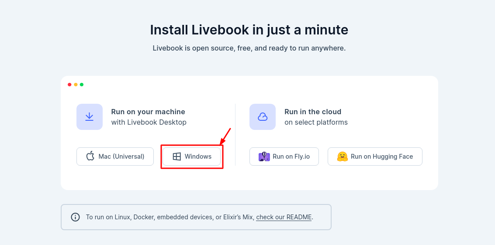
2. Após concluir, acesse a pasta onde foi baixado o arquivo. Clique com o botão direito sobre o arquivo e "Abrir".
> Dependendo de qual a configuração de antivírus do seu computador o Windows Defender pode tentar barrar a instalação nesse caso clique em "Mais informações" (ou "More info" se seu Windows está configurado em Inglês) e então "Executar mesmo assim" ("Run anyway" caso inglês).
3. Ele vai mostrar o caminho onde serão instalados os arquivos de instalação do Livebook. Caso queira mude, quando estiver de acordo, clique "Próximo" (ou "Next" caso Inglês).
4. A instalação vai começar, isso pode levar alguns minutos.
>  Ao final da instalação o Windows Firewall caso ativo vai perguntar em quais redes deve permitir a comunicação do `erlang` e `epmd.exe` marque ambos checkboxes (caixas de marcação) em ambos e dê "Permitir acesso" (Allow Access) para ambos.
5. Dê "fechar" (close) na instalação.
6. Abra o menu de aplicações, pesquise "Livebook" e clique duas vezes sobre o ícone, isso vai abrir o livebook no navegador que está configurado como padrão no seu Windows.

</details>

<strong>🍎 MacOS:</strong>
<details>

Existem diversas formas para instalar o Elixir em seu macOS, porém, vamos começar com a instalação utilizando o `Homebrew`.

1. Instale o [Homebrew](https://brew.sh/), ele será nosso gerenciador de pacotes.
```sh
/bin/bash -c "$(curl -fsSL https://raw.githubusercontent.com/Homebrew/install/HEAD/install.sh)"
```

2. Verifique se o Homebrew foi instalado corretamente.
```sh
brew --version
```

3. O `PATH` do Homebrew deve ter sido referenciado em seu arquivo de configuração de shell (`.zshrc` ou `.bashrc`)s. Para conferir, execute `cat .zshrc | grep brew` ou `cat .bashrc | grep brew`. Caso não esteja, por favor, execute o comando abaixo para adicionar ao seu arquivo de configuração.
```sh
echo 'eval "$(/opt/homebrew/bin/brew shellenv)"' >> ~/.zshrc
```
> O comando acima vai "*avaliar*" o Homebrew e adicionar o `PATH` dele ao seu arquivo de configuração de shell. 
 
4. Atualize a lista de pacotes.
```sh
brew update
```

5. Instale o Elixir.
```sh
brew install elixir
```
> Automaticamente tanto o Erlang quanto o Elixir serão instalados utilizando a versão estável mais [recente](https://formulae.brew.sh/formula/elixir#default).

6. Verifique se o Elixir foi instalado corretamente.
```sh
elixir --version
```

7. Vamos rodar um comando (dois, separados por `,`) para atualizar o Rebar e Hex que são ferramentas importantes para Elixir usando o `mix` que é o gerenciador de dependências que foi instalado junto com Elixir.
```sh
mix do local.rebar --force, local.hex --force
```

8. E agora vamos instalar o livebook usando o `mix`, no final da instalação ele vai perguntar `[y/N]` ou `[s/N]` (dependendo de como seu sistema está configurado) e você precisa confirmar com `y` ou `s` de acordo para confirmar que você deseja instalar o pacote.
```sh
mix escript.install hex livebook
```

9. Maravilha! Agora o livebook já está instalado. Para testar execute o comando abaixo.
```sh
livebook serve
```

Perfeito! Agora você já tem o Elixir, Erlang e Livebook instalados corretamente. Caso queira instalar o Livebook de outra forma no macOS, recomendamos instalar utilizando o [instalador oficial na página do Livebook](https://livebook.dev/#install), basta baixar e instalar normalmente. Caso deseje utilizar múltiplas versões do Elixir, recomendo acessar o guia de instalação com o asdf.

</details>

<strong>🐧 GNU/Linux Ubuntu:</strong>
<details>

1. Faça uma atualização dos seus repositórios e uma atualização dos seus pacotes.
```sh
sudo apt update && sudo apt upgrade -y
```
2. Instale os programas de linha de comando `curl` e `git`caso ainda não os tenha instalados.
```sh
sudo apt install git curl -y
```
3. Adicione os repositórios do RabbitMQ, isso é necessário para termos uma versão mais recente de Elixir. Será necessário dar `Enter` em determinada parte do comando para confirmar que você quer realmente adicionar esse repositório.
```sh
sudo add-apt-repository ppa:rabbitmq/rabbitmq-erlang
```
> **Importante!** Esse é um passo necessário, pois a versão de Elixir nos repositórios do Ubuntu atualmente é a `v1.12.2` e o livebook precisa de Elixir na versão `v1.14.2` ou superior para rodar corretamente.
4. Atualize novamente os repositórios para receber as atualizações com as versões de Elixir e Erlang nos repositórios do RabbitMQ.
```sh
sudo apt update && sudo apt upgrade -y
```
5. Instale Elixir (Isso irá instalar o erlang como dependência!)
```sh
sudo apt install elixir -y
```
6. Precisamos também instalar algumas bibliotecas erlang para que possamos instalar o livebook com sucesso.
```sh
sudo apt install erlang-inets erlang-os-mon erlang-runtime-tools erlang-ssl erlang-xmerl erlang-dev erlang-parsetools -y
```
7. Vamos rodar um comando (dois, separados por `,`) para atualizar o Rebar e Hex que são ferramentas importantes para Elixir usando o `mix` que é o gerenciador de dependências que foi instalado junto com Elixir.
```sh
mix do local.rebar --force, local.hex --force
```
8. E agora vamos instalar o livebook usando o `mix`, no final da instalação ele vai perguntar `[y/N]` ou `[s/N]` (dependendo de como seu sistema está configurado) e você precisa confirmar com `y` ou `s` de acordo para confirmar que você deseja instalar o pacote.
```sh
mix escript.install hex livebook
```
9. Precisamos adicionar caminho para os pacotes instalados pelo escript na Variável PATH do Ubuntu para que possamos rodá-los como programas.
```sh
echo 'export PATH=$PATH:/root/.mix/escripts' >> ~/.bashrc
source ~/.bashrc # ou feche e abra um novo terminal

# Ou aponte para o .zshrc caso utilize o zsh.
echo 'export PATH=$PATH:/root/.mix/escripts' >> ~/.zshrc
source ~/.zshrc # ou feche e abra um novo terminal
```
10. Rodar o livebook em sua máquina e acessar o link que ele vai lhe dar no navegador.
```
livebook server
```
 
</details>

<strong>🐋 Docker:</strong>
<details>

Caso você possua o Docker instalado na sua máquina e deseja rodar o livebook a partir de uma imagem basta rodar:

```sh
docker run -p 8080:8080 -p 8081:8081 --pull always -u $(id -u):$(id -g) -v $(pwd):/data ghcr.io/livebook-dev/livebook
```

Para isso *não* é necessário nenhum outro pré-requisito, não é necessário ter Elixir instalado em sua máquina.

</details>

<strong>🪂 Fly.io:</strong>
<details>

> Esse método necessita de um catão de crédito com validade internacional. O livebook se enquadra no [free tier](https://fly.io/docs/about/pricing/#free-tier) do fly.io, porém é importante que você leia sobre e entenda as limitações desse plano.

1. Acesse o site do Livebook [livebook.dev](https://livebook.dev/#install) e desça até a instalação e clique no botão para acessar o Fly.io.

<p align="center">
 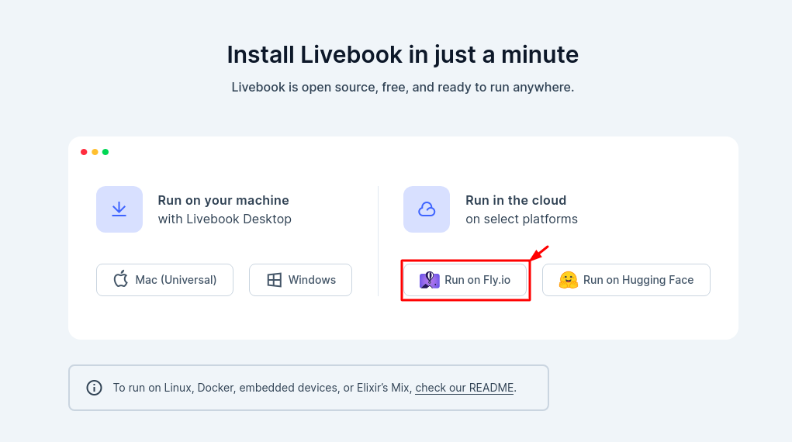
</p>

2. Escolha o login com a conta do Google ou GitHub como for mais conveniente, caso não possua uma conta em nenhum desses serviços será necessário criá-la primeiro.

<p align="center">
 
</p>

3. Antes de continuar temos que configurar nossa opção de pagamento, adicionando um cartão de crédito. Para isso visite [fly.io](https://fly.io/) e acesse o botão "Dashboard".

<p align="center">
 
</p>

4. Clique em "Billing".

<p align="center">
 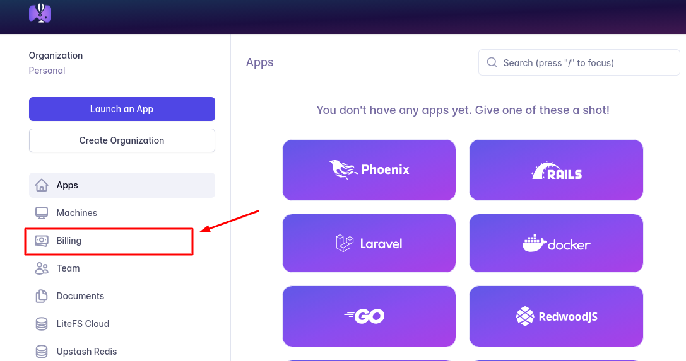
</p>

5. Vá em "add credit card".

<p align="center">
 
</p>

6. Preencha seus dados no formulário da Stripe e confirme.
   
7.  Volte na página onde criamos o login [fly.io/launch/livebook](https://fly.io/launch/livebook)

8. Preencha o formulário, onde diz "App Name" você deve preencher qual será o nome de sua instância - esse nome deve ser único -, preencha como achar melhor, nesse caso colocamos "learn4elixir", e onde diz "Password" é onde vai colocar a senha para que somente você possa acessar essa instância. 

<p align="center">
 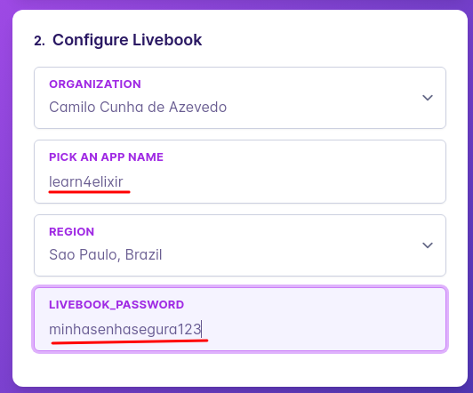
</p>

9. Clique em "launch" e deverá ver essa tela onde será iniciado o processo de subir um livebook na infraestrutura cloud do fly.io.

<p align="center">
 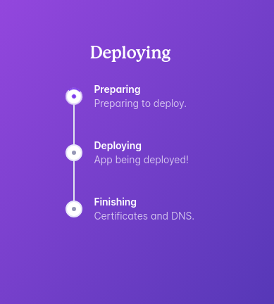
</p>

10. Quando estiver pronto ele vai te mostrar a URL e senha do seu livebook, lembre-se de guardar essas informações em um lugar seguro e de nunca compartilhar sua senha. 

<p align="center">
 
</p>

11. Acesse a URL, agora você pode acessar esse livebook de qualquer lugar a partir dela, e coloque a sua senha. Se tudo der certo, você já terá acesso ao livebook.


</details>

<strong>🤗 Hugging Face:</strong>
<details>

1. Acesse o site do Livebook [livebook.dev](https://livebook.dev/#install) e desça até a instalação e clique no botão para acessar o Hugging Face.

<p align="center">
 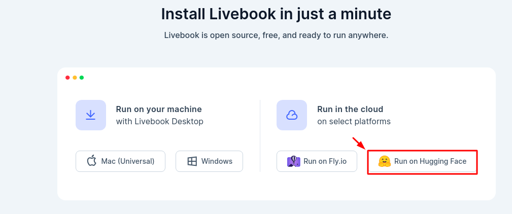
</p>


2. Clique em "sign in" caso ainda não tenha uma conta (faça login caso tenha).

<p align="center">
 
</p>

2.Preencha os dados do perfil, aceite os termos de uso e continue.

<p align="center">
 
</p>

> Será enviado um e-mail de confirmação para seu e-mail cadastrado é importante que confirme-o.

3. Na próxima página preencha o nome da instância...

<p align="center">
 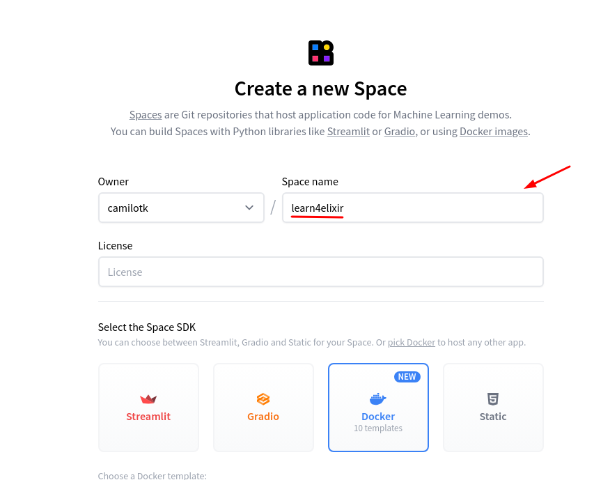
</p>

3. Escolha "Livebook", uma máquina da categoria gratuita ("FREE") e adicione a senha de sua instância.

<p align="center">
 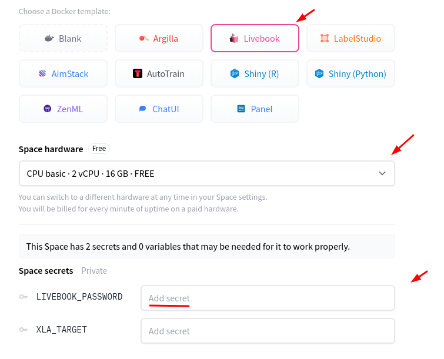
</p>

3. Por fim escolha se a instância deve ser pública ou privada e clique em "create".

<p align="center">
 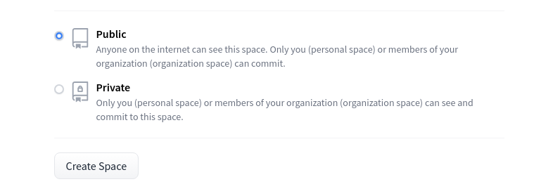
</p>

4. Após concluir o build da imagem, clique na aba "container".

<p align="center">
 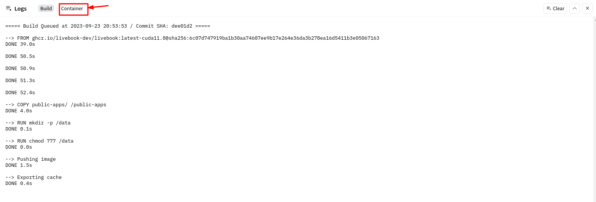
</p>

5. Copie o seu token e feche a aba.

<p align="center">
 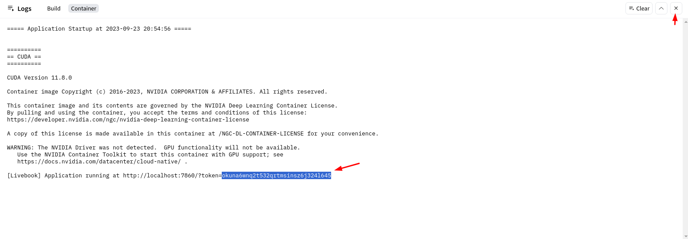
</p>

> Caso tenha fechado sem querer esse prompt com as abas, pode abrir ele novamente clicando no botão "Logs" ao lado de "Running".
> 
> 


5. Cole o seu token e autentique, terá acesso a um livebook rodando na infraestrutura da Hugging Face.


</details>

<strong>🚣‍♀️ ASDF:</strong>
<details>

O [asdf](https://asdf-vm.com/) é um gerenciador de versões para múltiplas linguagens de programação, incluindo Elixir e Erlang. Caso você queira gerenciar múltiplas versões de sua instalação, recomendamos fortemente que utilize-o.

1. Instale as dependências necessárias.

| Sistema Operacional | Gerenciador de Pacotes | Comando                          |
|---------------------|------------------------|----------------------------------|
| Linux               | Aptitude               | apt install curl git             |
| Linux               | DNF                    | dnf install curl git             |
| Linux               | Pacman                 | pacman -S curl git               |
| Linux               | Zypper                 | zypper install curl git          |
| macOS               | Homebrew               | brew install coreutils curl git  |
| macOS               | Spack                  | spack install coreutils curl git |

2. Instale o asdf seguindo as instruções do [site oficial](https://asdf-vm.com/guide/getting-started.html). Recomendo utilizar a versão `Bash & Git` ou `Zsh & Git`.
```sh
git clone https://github.com/asdf-vm/asdf.git ~/.asdf --branch v0.13.1

# Bash & Git
echo -e '\n. $HOME/.asdf/asdf.sh' >> ~/.bashrc
echo -e '\n. $HOME/.asdf/completions/asdf.bash' >> ~/.bashrc # Apenas para as completions

# Zsh & Git
echo -e '\n. $HOME/.asdf/asdf.sh' >> ~/.zshrc
```

3. Instale o [plugin do Erlang](https://github.com/asdf-vm/asdf-erlang).
```sh
asdf plugin add erlang https://github.com/asdf-vm/asdf-erlang.git

# .bashrc
echo -e '\n export KERL_CONFIGURE_OPTIONS="--disable-debug --without-javac"' >> ~/.bashrc

# .zshrc
echo -e '\n export KERL_CONFIGURE_OPTIONS="--disable-debug --without-javac"' >> ~/.zshrc

# Instalando a versão mais recente do Erlang
asdf install erlang latest

# Definindo-a como a versão a ser utilizada
asdf global erlang latest
```

4. Instale o [plugin do Elixir](https://github.com/asdf-vm/asdf-elixir).
```sh
asdf plugin-add elixir https://github.com/asdf-vm/asdf-elixir.git

# Instalando a versão mais recente do Elixir
asdf install elixir latest

# Definindo-a como a versão a ser utilizada
asdf global elixir latest
```

5. Para verificar a versão de seu Elixir, execute o comando abaixo.
```sh
elixir --version
```

6. Vamos rodar um comando (dois, separados por `,`) para atualizar o Rebar e Hex que são ferramentas importantes para Elixir usando o `mix` que é o gerenciador de dependências que foi instalado junto com Elixir.
```sh
mix do local.rebar --force, local.hex --force
```

7. E agora vamos instalar o livebook usando o `mix`, no final da instalação ele vai perguntar `[y/N]` ou `[s/N]` (dependendo de como seu sistema está configurado) e você precisa confirmar com `y` ou `s` de acordo para confirmar que você deseja instalar o pacote.
```sh
mix escript.install hex livebook
```

8. Maravilha! Agora o livebook já está instalado. Para testar execute o comando abaixo.
```sh
livebook serve
```

Teve algum problema com a instalação? Não se esqueça de checar o [guia oficial do asdf](https://asdf-vm.com/guide/getting-started.html)! Teve algum outro problema específico? Abra uma [issue](https://github.com/Universidade-Livre/Learn4Elixir/issues/new) e teremos o prazer em auxiliar!

</details>

## Quem somos nós?

<p align="justify">
O Learn4Elixir é mantido por uma equipe de entusiastas da programação funcional e da linguagem Elixir. Eles trabalham em conjunto para tornar esses conceitos acessíveis a todos os 
interessados. Para isso ser alcançado foi necessário diversas atividades, desde da ideia, execução do evento, criação de conteúdo educacional, que inclui tutoriais e exercícios até 
comunicação institucional e outras atividades. Além disso, uma equipe de suporte está disponível para oferecer orientação e assistência aos alunos, garantindo uma jornada de 
aprendizado produtiva. Isso tudo junto foi executado por essa equipe maravilhosa que trabalhou unida e assumiu responsabilidades como um time para fazer o evento acontecer.
</p>

<table align="center">
  <tr>
    <td align="center"><a href="https://github.com/Camilotk"><br /><sub><b>Camilo de Azevedo</b></sub></a><br /> <a href="#maintenance-Camilotk" title="Maintenance">🚧</a> </td>
    <td align="center"><a href="https://github.com/mateusrovedaa"><br /><sub><b>Mateus Roveda</b></sub></a><br /><a href="#maintenance-mateusroveda" title="Maintenance">🚧</a> </td>
    <td align="center"><a href="https://github.com/adolfont"><br /><sub><b>Adolfo Neto</b></sub></a><br /><a href="#content-adolfo" title="Content">🖋</a></td>
    <td align="center"><a href="https://github.com/wesleyscheifer77"><br /><sub><b>Wesley Scheifer</b></sub></a><br /><a href="#content-wesley" title="Content">🖋</a></td>
  </tr>
  <tr>
    <td align="center"><a href="https://github.com/anabastos"><br /><sub><b>Ana Bastos</b></sub></a><br /><a href="#mentoring-ana" title="Mentoring">🧑‍🏫</a></td>
    <td align="center"><a href="https://github.com/cherryramatisdev"><br /><sub><b>Cherry Ramatis</b></sub></a><br /><a href="#mentoring-cherry" title="Mentoring">🧑‍🏫</a></td>
    <td align="center"><a href="https://github.com/digzom"><br /><sub><b>Dickson Melo</b></sub></a><br /><a href="#mentoring-dickson" title="Mentoring">🧑‍🏫</a></td>
    <td align="center"><a href="https://github.com/douglastofoli"><br /><sub><b>Douglas Tofoli</b></sub></a><br /><a href="#mentoring-douglas" title="Mentoring">🧑‍🏫</a></td>
  </tr>

  <tr>
    <td align="center"><a href="https://github.com/lanjoni"><br /><sub><b>Guto Lanjoni</b></sub></a><br /><a href="#mentoring-guto" title="Mentoring">🧑‍🏫</a></td>
    <td align="center"><a href="https://github.com/eulixir"><br /><sub><b>João Pedro Alves</b></sub></a><br /><a href="#mentoring-joao" title="Mentoring">🧑‍🏫</a></td>
    <td align="center"><a href="https://github.com/OtavioSC"><br /><sub><b>Otávio Carmo</b></sub></a><br /><a href="#mentoring-otavio" title="Mentoring">🧑‍🏫</a></td>
    <td align="center"><a href="https://github.com/Cyytrus"><br /><sub><b>Paulo Castro</b></sub></a><br /><a href="#mentoring-paulo" title="Mentoring">🧑‍🏫</a></td>
  </tr>

  <tr>
    <td align="center"><a href="https://github.com/zoedsoupe"><br /><sub><b>Zoey Pessanha</b></sub></a><br /><a href="#mentoring-zoedsoupe" title="Mentoring">🧑‍🏫</a></td>
  </tr>
</table>

<p align="justify">
  
Além disso todo material gráfico foi produzido pelo [Lucas Soren](https://github.com/lucassoren) que foi contratado para essa tarefa com os recursos de patrocínio.
Além de ser extramamente habilidoso com arte, também está estudando para ser DEV e caso tenham interesse em também contratá-lo, entre em contado.

</p>

## Como nos ajudar?
Você pode nos ajudar de diversas formas:
- **Nos dê feedback**: Se você está fazendo o Learn4Elixir para nós saber como está sendo sua experiência é muito importante. Você pode fazer isso através desse formulário.
- **Divulgação**: Para nós é muito dificil ter alcance e chegar em mais pessoas. Compartilhar sobre o projeto com mais pessoas nos ajuda a atingir pessoas que podem ser impactadas por essa iniciativa. Compartilhe sobre esse projeto nas suas redes sociais, converse sobre com seus amigos, indique para pessoas que queiram aprender Elixir, deixe um star nesse repositório e nos ajude compartilhando nosssas postagens sobre.
- **Ajude outros estudantes**: Entre no nosso [Discord](https://discord.gg/eXUBTY6HAu), esteja atento nas issues, quando outras pessoas tiverem dificuldade ou dúvidas, ajude! O aprendizado é sempre catalizado por pessoas com o mesmo objetivo, quando todos se ajudam chegam mais longe e isso torna a joranada melhor para quem ajuda e para quem é ajudado.
- **Faça um PR**: Encontrou um erro? Algo que pode ser melhorado? Faça um Pull Request que vamos avaliar, discutir e atualizar o material. Todos cometem erros e tudo pode ser melhorado, é com a ajuda da Comunidade que construímos coisas cada vez melhor.
- **Revisão de PR**: Tem um PR que outra pessoa fez em aberto? Clone-o, teste, opine. Ajude a avaliar e revisar PRs. Toda discussão útil é bem-vinda e nos ajuda a melhorar.

## Patrocínio

<table align="center">
  <tr>
    <td valign="center" width="50%">
      <a href="https://www.cumbuca.com/">
        
      </a>
    </td>
    <td valign="center" width="50%">
      <a href="https://hotmart.com/pt-br/marketplace/produtos/nomadz">
        
      </a>
    </td>
  </tr>
</table>
